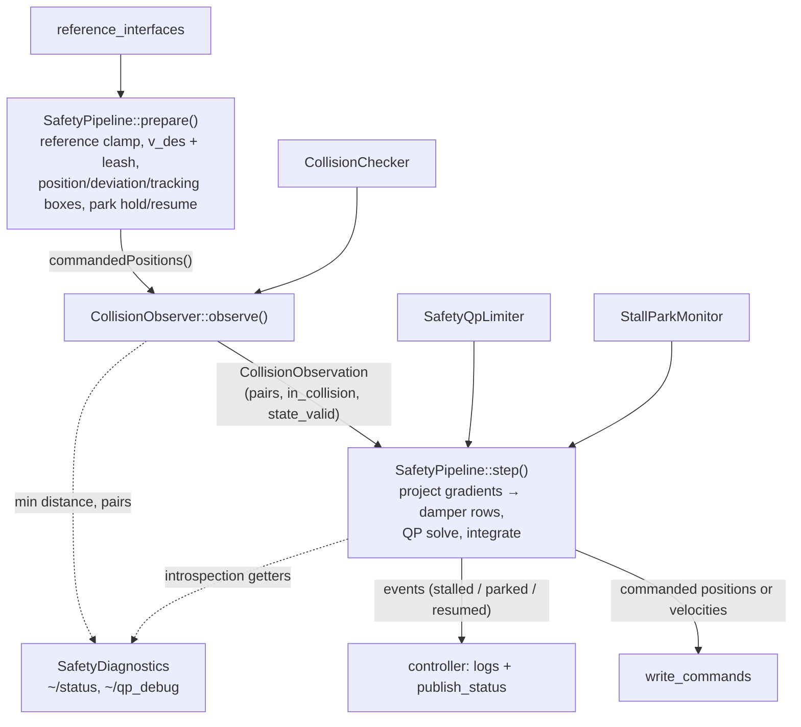

# SafetyPositionController

Chained controller that projects the incoming reference onto a safe motion: bounded
velocity/acceleration, position-limit braking, self-collision velocity dampers with
flow-around (ProxQP), per-joint deviation boxes, and a stall/park state machine. The
`interface_type` parameter decides whether it takes and writes joint positions or joint
velocities; see [Interface kind](#interface-kind).

## Components

| Class / file | Role | ROS? |
|---|---|---|
| `SafetyPositionController` | ros2_control shell: lifecycle, interfaces, E-stop, bypass, reference unwrap/clamp, event → log/status translation | yes |
| `SafetyPipeline` | Per-cycle control law: desired velocity + reference leash, position/deviation/tracking boxes, constraint projection, solve, integration, stall/park. Returns **events**, never logs | no |
| `SafetyQpLimiter` | The dense QP itself (velocity boxes, braking bounds, collision dampers, tiered infeasibility relaxation) | no |
| `StallParkMonitor` | Stall / park state machine (park latch survives E-stop) | no |
| `CollisionChecker` | Pinocchio + coal self-collision distances and gradients | yes (logging only) |
| `CollisionVisualizer` | RViz markers on `~/debug_collision_geometry`: distance lines colored by approach direction, optionally the collision geometry | yes |
| `CollisionObserver` | Assembles the check configuration (measured + commanded overlay), runs the checker, caches results, edge-triggers "entered collision" | no |
| `SafetyDiagnostics` | `~/status`, `~/qp_debug`, debug joint states, warning formatters | yes |
| `joint_info.*` | `JointInfo` (URDF types/limits), `parse_joint_infos()`, angle helpers | no |

The ROS-free core (`SafetyPipeline` + `SafetyQpLimiter` + `StallParkMonitor`) has fast
pure unit tests (`test_safety_pipeline.cpp`, `test_safety_qp_limiter.cpp`) that run
without a controller-manager fixture.

## Per-cycle data flow

The collision check must run at the *commanded* configuration, which lives inside the
pipeline — hence the two-phase `prepare()` / `step()` protocol:



The E-stop path bypasses all of this: the controller holds the latched positions (zero
velocity in velocity mode) and calls `pipeline->invalidate()`, so on release the pipeline
rebases to the measured state and parks — the arm holds until a new reference arrives, one
that differs from the abandoned target by more than `park_resume_reference_threshold`, or
a demand that was let go and made again.

Two more routes reach that same rebase-and-park, both through `note_state_unobservable()`
and its `state_read_timeout`: joint states that stay unreadable, and a joint that has left
its command by more than twice `tracking_leash` (`SafetyPipeline::measurementDiverged()`,
position mode only — a velocity command is not something a joint can fall behind).
The second one matters because the collision check runs at the *commanded* configuration:
once the robot is somewhere else, that check is validating a pose the robot has left. It is
also what keeps a continuous joint's wrapped lag from reaching pi, where it would name the
other side of the joint and mirror the tracking box onto the wrong side of the command.

The safety bypass drops collision checking and widens the position limits; it does **not**
relax the velocity, acceleration or tracking-leash bounds. It lapses on a deadline the
update loop enforces, and is cleared on every activation and deactivation.

## Where to change what

- **Safe-set math** (dampers, braking, relaxation stages): `safety_qp_limiter.cpp`.
- **Cycle behavior** (leash, boxes, stall/park semantics): `safety_pipeline.cpp` — add a pure unit test in `test_safety_pipeline.cpp`. Every bound is a box the QP solves against, so what gets written is one bounded step away from the configuration the collision check ran on, taken under the velocity, acceleration and damper limits that check produced — not a correction applied afterwards that none of them saw.
- **Which pairs constrain** (pair filtering, budget, gradients): `collision_checker.cpp`.
- **Marker appearance** (colors, namespaces, what is drawn): `collision_visualizer.cpp`.
- **New status/debug output**: `safety_diagnostics.cpp` + the msg definitions in `hector_ros_controllers_msgs`.
- **Parameters**: `params/safety_position_controller_parameters.yaml` (generate_parameter_library), plumbed into `SafetyPipeline::Config` in `setup_pipeline_on_activate()`.
- **Interface kind**: `SafetyPipeline::Config::velocity_mode` for the cycle behavior, `velocity_mode_` in the controller for interfaces, writes and reference lifetime.

## Interface kind

`interface_type` selects, for the references it exports and the command interfaces it
claims, `position` (the default) or `velocity`. The state interfaces are positions in both
cases: the collision check and the safety boxes need to know where the robot is.

| | `position` | `velocity` |
|---|---|---|
| A reference means | go here | move at this rate |
| Written to the hardware | the commanded position | the commanded velocity |
| Who integrates | the pipeline (`cmd_`) | the hardware |
| Checked configuration | the command about to be written | the measurement plus one step |
| Reference leash, deviation boxes, tracking leash | active | dropped, with a warning if configured |
| A reference that stops being updated | is reached and held | is consumed, so the joint brakes |
| A cycle the pipeline cannot run | leaves the last command, which holds | writes zero velocity |
| Park released by | a target that differs from the abandoned one | letting the demand go and asking again |
| A joint jammed by something the QP cannot see | stalls and parks | keeps pushing while the demand is held |

The last row is a consequence of the row above it, not an oversight. Stall is reported when
the commanded motion is near zero although the reference asks for it, and in position mode
the tracking leash is what drove the command to zero against a joint that could not follow.
Without it, a mechanical blockage nothing in the model knows about leaves the commanded
velocity untouched, so it is the operator holding the demand who decides how long the joint
pushes. Blockages the QP does see - collisions, position limits - still stall and park in
both modes.

The three bounds are dropped because each of them relates the command to a position target:
a velocity reference has none, and the hardware integrating means the command cannot run
ahead of the joint in the first place. Leaving them on would not bound anything - a box
around a command that is re-centred on the measurement every cycle is empty - but their
braking envelope would silently cap the speed at `sqrt(2 * a_dec * limit)`.

Velocity references are consumed (set to `NaN`) at the end of every cycle. A chained
reference is a value that stays where it was written, and a demand that stays put is a
sender that stopped and a joint that does not; consuming it means an upstream that goes
silent brakes on the next cycle. The `~/commands` path re-applies its last message for
`velocity_command_timeout` and then lets it lapse. Both leave the demand at "no target",
which brakes at the deceleration limit rather than cutting the command to zero.

There is no position hold in velocity mode: zero demand is zero velocity, and the joint
stays wherever it stopped, less whatever gravity backdrives.

## Reference input

The controller accepts references from two sources and forwards the checked (and, where
the safety pipeline had to intervene, modified) command to the hardware in both cases:

- **Chained mode**: the exported reference interfaces (`<controller>/<joint>`), written by
  the upstream controller.
- **Non-chained mode**: the `~/commands` topic (`Float64MultiArray`, exactly one entry per
  joint). A message of any other length is dropped whole and the previous reference kept:
  applying a prefix would leave the joints it does not name on an older command's targets,
  which is a pose nobody asked for and which the sender cannot tell from success.

A `NaN` reference (per joint) means "no target": it demands zero velocity, so the joint
brakes to a smooth stop at the deceleration limit and holds. References are reset to NaN
on activation and when the reference source changes, so a stale target can never be
resumed there. An E-stop release does not reset them: it parks instead, which latches the
reference in effect as abandoned and holds until a reference arrives that differs from it.

## Performance baseline

Measured in a **Release** build (`-DCMAKE_BUILD_TYPE=Release -DBUILD_TESTING=ON`) with
`athena.urdf`, 999 collision pairs after filtering, 7 controlled joints:

| Benchmark | Time |
|---|---|
| `BM_Broadphase_DistanceOnly` | 32 µs |
| `BM_Broadphase_Folded` (gradients) | 43 µs |
| `BM_Broadphase` (gradients) | 84 µs |
| `BM_CollisionChecker` (brute force) | 437 µs |
| `BM_SolveWarmStarted/7/0` (QP, no collision rows) | 11.3 µs |
| `BM_SolveWarmStarted/7/10` (QP, 10 collision rows) | 11.8 µs |

The QP row count is bounded by `qp_max_pair_constraints`, which both Athena configs now set
to 64. The table above stops at 10, the old default, so it no longer covers the deployed
operating point — extend the benchmark before quoting a solve time for the robot.

The narrow phase runs in a single pass: coal returns the witness points from the same
query as the distance, so asking for them up front is cheaper than re-running the query
for the safety-zone pairs (broadphase 116 µs → 84 µs, folded 56 µs → 43 µs).

Run them with:

```bash
# cap the parallelism: a full-parallel build of this package exhausts RAM
MAKEFLAGS=-j2 colcon build --packages-select hector_ros_controllers \
  --parallel-workers 1 --cmake-args -DCMAKE_BUILD_TYPE=Release -DBUILD_TESTING=ON
./build/hector_ros_controllers/benchmark_collision_checker
./build/hector_ros_controllers/benchmark_safety_qp_limiter
```

The default (Debug) build is roughly 40x slower for the QP and must not be used for
timing claims. On the robot the arm cycle measured 57 µs mean / 194 µs max QP solve time
at 2.3 solver iterations.

## Coverage

`./run_coverage.sh` (in `src/hector_ros_controllers/`) builds with coverage flags, runs
the test suite and writes `coverage_report/index.html` plus a per-file summary. Coverage
data comes from the rtest `controllers_test_doubles` target, not from `controllers` — see
the comment at the top of the script before changing the capture.
