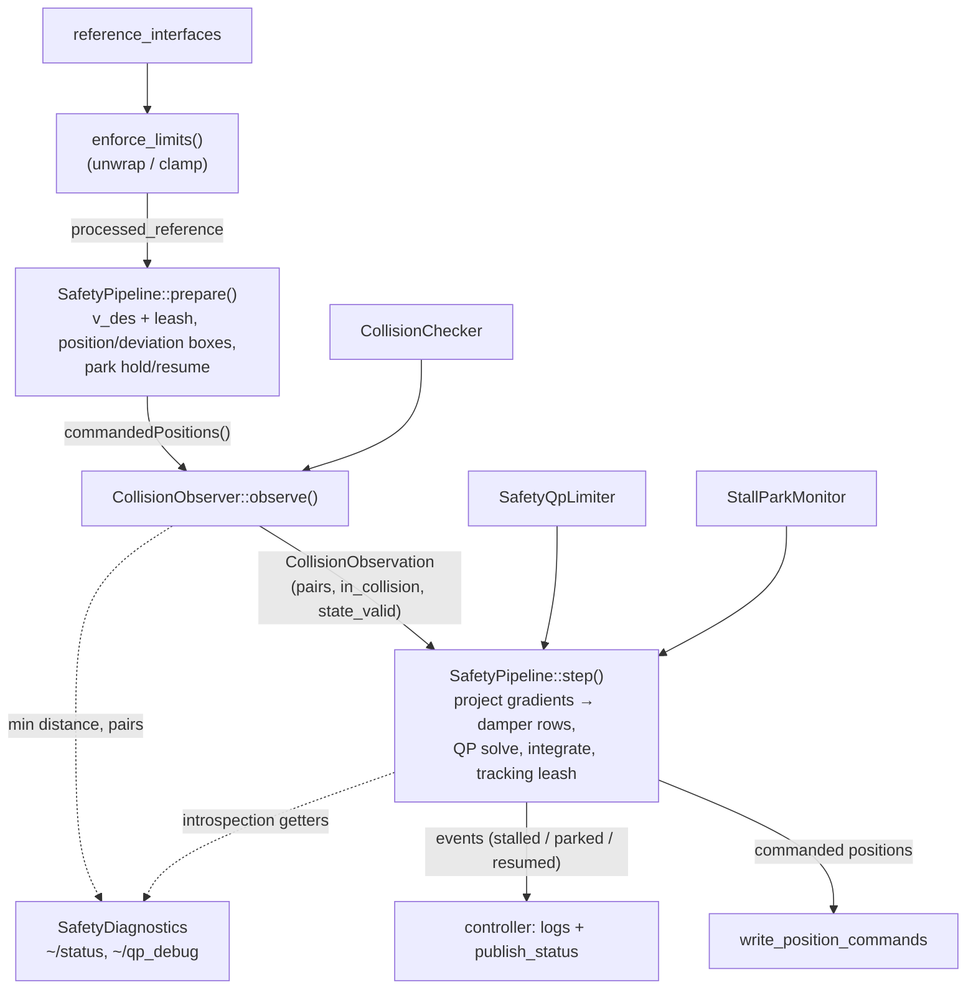

# SafetyPositionController

Chained position controller that projects the incoming reference onto a safe motion:
bounded velocity/acceleration, position-limit braking, self-collision velocity dampers
with flow-around (ProxQP), per-joint deviation boxes, and a stall/park state machine.

## Components

| Class / file | Role | ROS? |
|---|---|---|
| `SafetyPositionController` | ros2_control shell: lifecycle, interfaces, E-stop, bypass, reference unwrap/clamp, event → log/status translation | yes |
| `SafetyPipeline` | Per-cycle control law: desired velocity + leashes, position/deviation boxes, constraint projection, solve, integration, stall/park. Returns **events**, never logs | no |
| `SafetyQpLimiter` | The dense QP itself (velocity boxes, braking bounds, collision dampers, tiered infeasibility relaxation) | no |
| `StallParkMonitor` | Stall / park state machine (park latch survives E-stop) | no |
| `CollisionChecker` | Pinocchio + coal self-collision distances, gradients, RViz markers | yes |
| `CollisionObserver` | Assembles the check configuration (measured + commanded overlay), runs the checker, caches results, edge-triggers "entered collision" | yes |
| `SafetyDiagnostics` | `~/status`, `~/qp_debug`, debug joint states, warning formatters | yes |
| `joint_info.*` | `JointInfo` (URDF types/limits), `parse_joint_infos()`, angle helpers | no |

The ROS-free core (`SafetyPipeline` + `SafetyQpLimiter` + `StallParkMonitor`) has fast
pure unit tests (`test_safety_pipeline.cpp`, `test_safety_qp_limiter.cpp`) that run
without a controller-manager fixture.

## Per-cycle data flow

The collision check must run at the *commanded* configuration, which lives inside the
pipeline — hence the two-phase `prepare()` / `step()` protocol:

The E-stop path bypasses all of this: the controller holds the latched positions and
calls `pipeline->invalidate()`, so the pipeline rebases to the measured state on
release (the park latch survives).

## Where to change what

- **Safe-set math** (dampers, braking, relaxation stages): `safety_qp_limiter.cpp`.
- **Cycle behavior** (leashes, deviation boxes, stall/park semantics): `safety_pipeline.cpp` — add a pure unit test in `test_safety_pipeline.cpp`.
- **Which pairs constrain** (pair filtering, budget, gradients): `collision_checker.cpp`.
- **New status/debug output**: `safety_diagnostics.cpp` + the msg definitions in `hector_ros_controllers_msgs`.
- **Parameters**: `params/safety_position_controller_parameters.yaml` (generate_parameter_library), plumbed into `SafetyPipeline::Config` in `setup_pipeline_on_activate()`.
